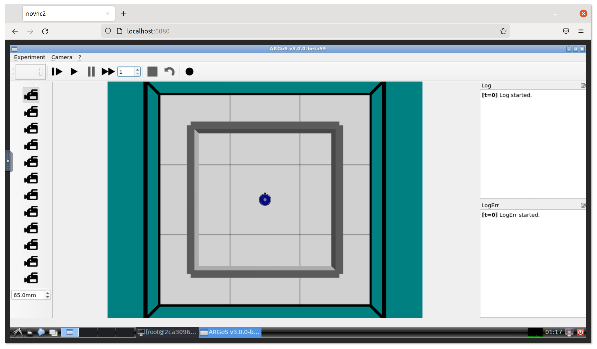

# ARGoS in Docker

> Portable robot simulation environment, using [ARGoS](https://github.com/ilpincy/argos3). Built within docker containers & displayed via browser-based VNC (noVNC), ARGoS should now be accessable on **all platforms**.

## Usage
```bash
$ docker run -p 6080:80 -v /dev/shm:/dev/shm tjferrara/argos3:latest
```

Visit http://localhost:6080 on your browser of choice, to display the GUI.


 ___

### [ Optional ] Customization 
```bash
$ docker run \
    -e USER=doro \                  # Create a new user
    -e PASSWORD=password \          # Password for new user
    -e RESOLUTION=1920x1080 \       # Resolution of VNC
    -e HTTP_PASSWORD=mypassword \   # Password for VNC
    -p 6080:80 -v /dev/shm:/dev/shm tjferrara/argos3:latest
```
These options are given by the base image `dorowu/ubuntu-desktop-lxde-vnc`.
For more customization information, visit https://hub.docker.com/r/dorowu/ubuntu-desktop-lxde-vnc.

## Build it yourself

To build and run the container:
```bash
$ git clone https://github.com/tylerferrara/argos3-docker.git argos3-docker
$ cd argos3-docker
$ docker-compose up --build
```
**NOTE:** This can take up to 15min to compile as it builds ARGoS from source.
